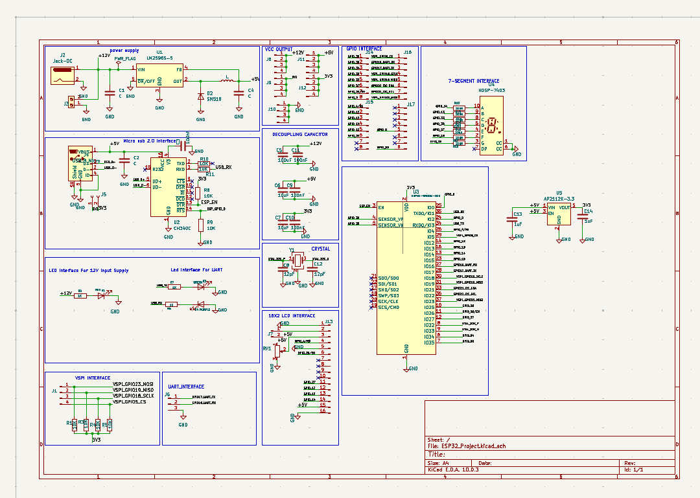
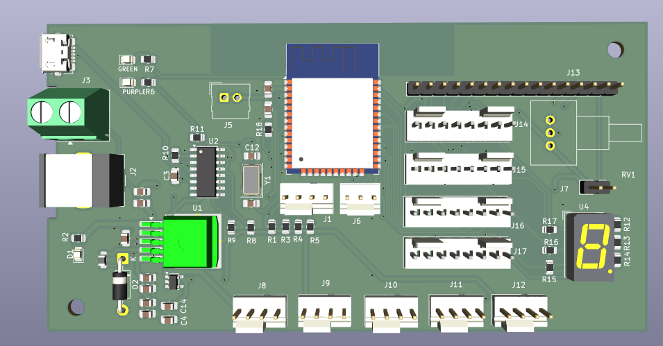
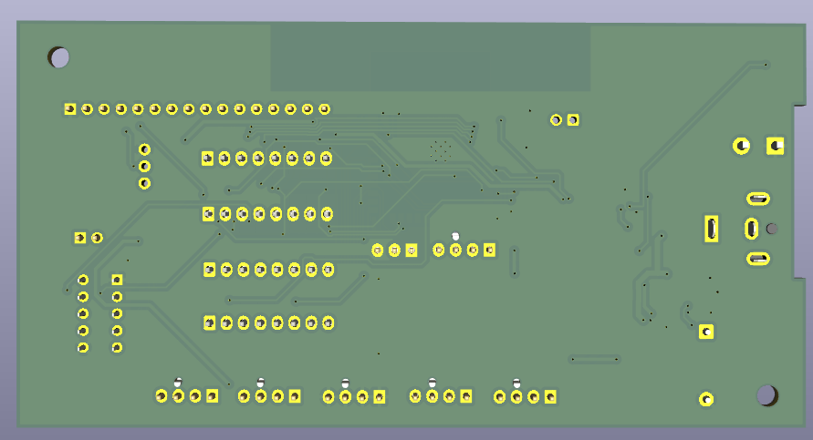

# ESP32-CUSTOM-DEVELOPMENT-BOARD

A custom-designed **ESP32-WROOM-32D Development Board** developed using **KiCad 10**. This project demonstrates the complete PCB design workflow, including schematic design, PCB layout, routing, ground plane implementation, ERC/DRC verification, and generation of manufacturing-ready Gerber files.

---

## 📖 Project Overview

This development board is designed for embedded systems and IoT applications. The board integrates the ESP32-WROOM-32D module with USB programming, power regulation, communication interfaces, and peripheral connectors while following standard PCB design practices.

---

## ✨ Features

- ESP32-WROOM-32D Microcontroller
- CH340C USB-to-UART Interface
- AP2112K-3.3 Voltage Regulator
- USB Programming Support
- UART Communication
- GPIO Expansion Headers
- 16×2 LCD Interface
- 7-Segment Display Interface
- VSPI Interface
- Crystal Oscillator Circuit
- Decoupling Capacitors
- 2-Layer PCB Design
- Ground Plane Implementation
- ERC & DRC Verified
- Manufacturing Ready Gerber Files

---

# 📷 Project Images

## Schematic



---

## PCB Top View



---

## PCB Bottom View



---

## ⚙️ Hardware Specifications

| Parameter | Specification |
|-----------|---------------|
| Microcontroller | ESP32-WROOM-32D |
| USB Interface | CH340C |
| Voltage Regulator | AP2112K-3.3 |
| PCB Layers | 2 |
| PCB Thickness | 1.6 mm |
| Copper Thickness | 1 oz |
| PCB Software | KiCad 10 |
| Manufacturing | JLCPCB Compatible |

---

## 📁 Repository Structure

```text
ESP32-CUSTOM-DEVELOPMENT-BOARD/
│
├── Image/
│   ├── PCB_Top.png
│   ├── PCB_Bottom.png
│   └── Schematic.png
│
├── Schematic/
│   └── ESP32_Project.kicad_sch
│
├── PCB/
│   └── ESP32_Project.kicad_pcb
│
├── Gerber/
│   └── ESP32_Gerber.zip
│
├── Documents/
│
├── README.md
└── LICENSE
```

---

## 🔄 PCB Design Workflow

1. Requirement Analysis
2. Circuit Design
3. Schematic Capture
4. Footprint Assignment
5. PCB Component Placement
6. PCB Routing
7. Ground Plane Implementation
8. ERC Verification
9. DRC Verification
10. Gerber File Generation
11. PCB Manufacturing

---

## 🏭 Manufacturing

The generated Gerber files are manufacturing-ready and can be directly uploaded to PCB fabrication services such as:

- JLCPCB
- PCBWay
- NextPCB

---

## 🚀 Future Improvements

- USB Type-C Interface
- ESD Protection
- Reverse Polarity Protection
- Test Points
- Buck Converter Based Power Supply
- Improved EMI/EMC Performance

---

## 👨‍💻 Author

**Yogesh Kumar**
